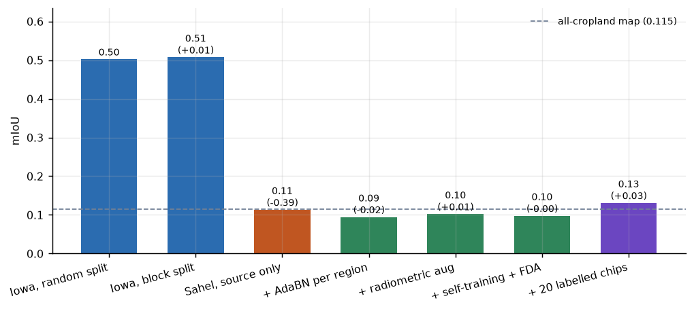
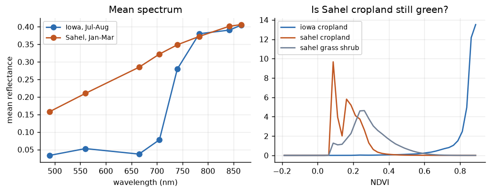
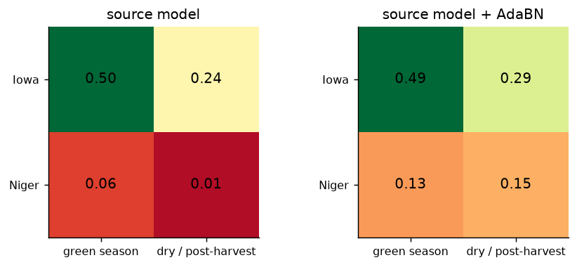
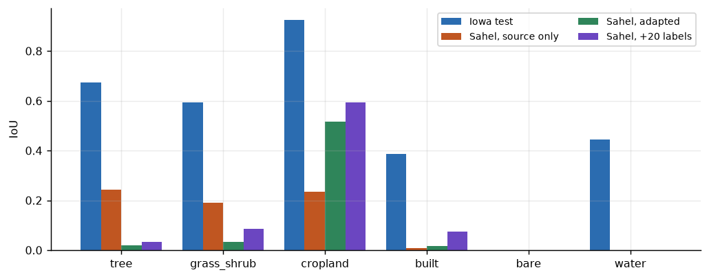
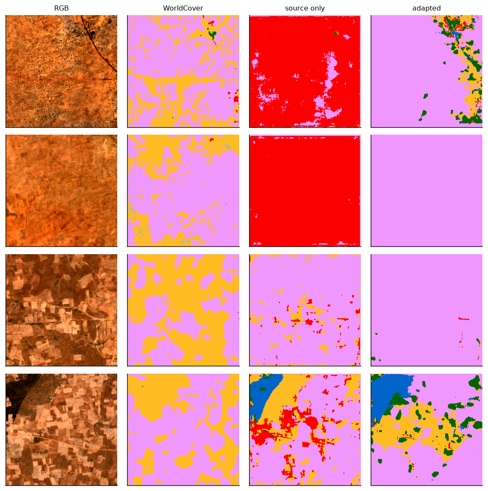
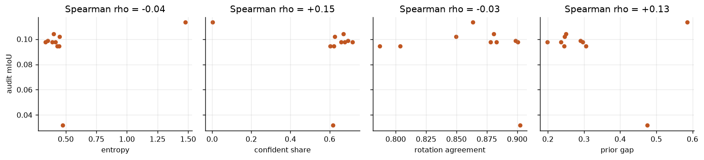
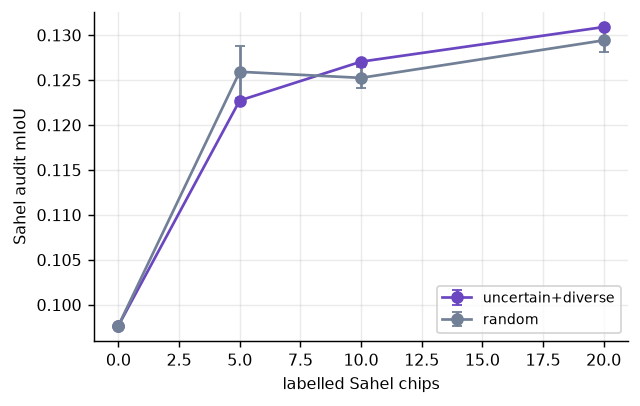

# Iowa - Sahel: why the land-cover model breaks and what I would do

A segmentation model trained on Iowa does well there and falls apart in a semi-arid region in another season. No data came with the task, so I rebuilt the setup myself:
- **Imagery:** Sentinel-2, 8 bands from 490 to 865 nm, close to Pixxel Firefly's range.
- **Labels:** ESA WorldCover.
- **Source:** Iowa in July–August.
- **Target:** Niger and Senegal in January–March.

The Sahel labels were never used for training. I only used them to score one held-out strip.

## What I found



- Iowa scores **0.51** mIoU and the Sahel **0.12**. Holding out whole regions instead of random chips cost 0.03, so the leak exists but is small.
- The model thinks the Sahel is a city. It labels **49%** of pixels "built-up"; the real share is under 1%. In Iowa, "bright and not green" meant roads and buildings.
- The shift is physical. The Sahel is 4–8× brighter in the visible bands, and NIR is almost the same.



- Season alone does a lot of damage. Iowa after harvest drops from 0.51 to **0.24** without leaving Iowa.



- In Niger, cropland and grass/shrub have the **same NDVI** (0.14 vs 0.16 in the dry season, 0.28 vs 0.28 in the wet season). From one image, "cropland" is a land-use label, not something the pixel shows.

## What I tried

| Method | mIoU | Pixel accuracy | Cropland IoU | Grass/shrub IoU |
|---|---|---|---|---|
| Map that says "cropland" everywhere | 0.115 | 0.58 | 0.58 | 0 |
| Source model as is | 0.120 | 0.31 | 0.31 | 0.17 |
| Standardise each region's bands | 0.023 | 0.08 | 0.12 | 0.01 |
| AdaBN, statistics from the scene being mapped | 0.093 | 0.45 | 0.51 | 0.03 |
| + TENT | 0.102 | 0.50 | 0.55 | 0.04 |
| + brightness augmentation toward Sahel | 0.101 | 0.47 | 0.50 | 0.06 |
| + class-balanced self-training + FDA | 0.097 | 0.47 | 0.50 | 0.04 |
| + 10 labelled Sahel chips | **0.139** | | 0.58 | **0.16** |




## How I read it

1. **AdaBN fixes the "city" mistake.** Pixel accuracy goes from 31% to about 50%. But the model then calls almost everything cropland, which is why mIoU does not move. Four of the six classes are under 1.5% of the Sahel pixels, so mIoU swings on tiny classes.
2. **BN statistics must come from the same scene.** Statistics taken from other Sentinel-2 dates in the same region made things worse.
3. **Standardising bands to look like Iowa was the worst idea.** It turns bright soil into "green-looking" numbers.
4. **Self-training fed on its own mistakes.** The share of "water" pseudo-labels grew from 4% to 7% with no water in the region. FDA added nothing on top of the brightness augmentation.
5. **Nothing without labels beat the all-cropland map.** So the leftover gap is about what the labels mean, not how the images look.
6. **I could not have picked the best method without labels.** Entropy, confidence, rotation agreement and prior gap all failed to rank the methods (best |ρ| = 0.38, wrong sign). Entropy does flag bad chips inside one model (ρ = −0.47), so I use it to choose what to label.



7. **A few labels beat every trick.** 5 labelled chips already beat everything above. With 10 chips, picking uncertain and diverse chips beat random ones (0.139 vs 0.129).



WorldCover itself is weak on Sahel cropland, so these Sahel scores are agreement with WorldCover, not true accuracy.

## What I would ship

- **Per-scene BN statistics at inference**, plus a drift monitor that returns OK / ADAPT / NEEDS_LABELS.
- **A small labelling loop:** 10–20 chips per new zone, chosen by uncertainty and diversity.
- **Next:** add a second-season image as input, because the cropland signal is in time, not in one date.

On two scenes the model never saw:

| Scene | Model | Monitor |
|---|---|---|
| Ségou, Mali | Iowa model | NEEDS_LABELS (42% "built", 10% "water") |
| Ségou, Mali | adapted + scene BN | OK |
| Western Iowa | Iowa model | ADAPT |
| Western Iowa | adapted + scene BN | OK |

## Run

```bash
docker build -t sahel .
docker run --rm --gpus all --shm-size 2g -v "$PWD:/work" sahel sh run.sh
docker run --rm --gpus all -v "$PWD:/work" sahel python -m sahel.predict data/demo_mali_dry.tif --scene-adabn
docker run --rm -v "$PWD:/work" sahel python tests/test_core.py
```

`steps/1_data.py` downloads the chips from Planetary Computer if `data/` is empty. A full run takes about 1.5 h on a 4 GB GTX 1650.
